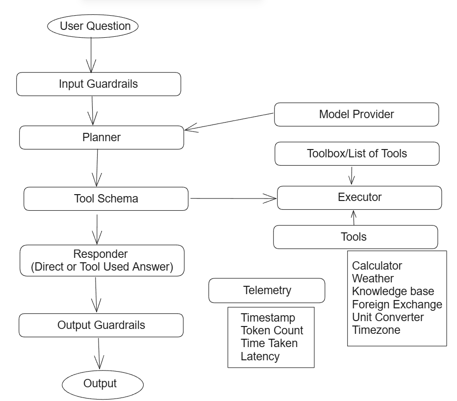

# Assignment Project from Optimizely

This project is completed as an assignment for Optimizely, focusing on making brittle code solid, typed, and easy to extend without using frameworks.

## Architecture



### Components

- **Input Guardrails:** trim, sanitize, token budget
- **Interpreter:** asks the model for a plan, not a final answer
- **Parser and Router:** fix messy output, enrich simple multi-step cases
- **Runner:** executes tool calls in order, uses placeholders t0, t1
- **Toolbox and Registry:** calculator, weather, knowledge base, foreign exchange, unit converter, translator, time and date
- **Responder:** returns either direct text or the last tool result
- **Output Guardrails:** validate type, round numbers, format text, redact unsafe bits
- **Telemetry:** logging, usage, price, latency from start to finish

## Key Behavior

- **Safety:** calculator uses AST, no eval
- **Typing:** schemas for plans and tool args
- **Fault tolerance:** malformed model output parsed with strict then loose strategies
- **Defaults:** static providers for tests, swap to real APIs by config


## Requirements

- **Python:** 3.10 or newer
- **OS:** Linux, macOS, Windows

## Setup

```bash
python -m venv .venv
# Windows: .venv\Scripts\activate
source .venv/bin/activate
pip install -r requirements.txt
cp .env.example .env
```

## Configure Model Provider

Choose one provider with environment variables:

```env
MODEL_PROVIDER=openai, anthropic, gemini, ollama, or fake
OPENAI_API_KEY=...        # when MODEL_PROVIDER=openai
ANTHROPIC_API_KEY=...     # when MODEL_PROVIDER=anthropic
GEMINI_API_KEY=...        # when MODEL_PROVIDER=gemini
OLLAMA_BASE_URL=http://localhost:11434  # when MODEL_PROVIDER=ollama
OLLAMA_MODEL=gemma2:2b                   # example
```

### Optional Telemetry Settings

```env
LOG_LEVEL=info, debug
ENABLE_PRICING=true or false
ENABLE_LATENCY=true or false
```

## Run

Pass your prompt to main.py:

```bash
python app/main.py "What is 12.5% of 243?"
# or
python -m app.main "Summarize today's weather in Paris in 3 words"
```

### Example Queries

The following examples should work out of the box:

```
"What is 12.5% of 243?"
"Who is Ada Lovelace?"
"Add 10 to the average temperature in Paris and London right now."
"Convert the average of 10 and 20 USD into EUR."
```

## Test

```bash
pytest -q
```

## Troubleshooting

- **No output:** check MODEL_PROVIDER, API key, .env loaded
- **Ollama errors:** confirm base URL, model pulled
- **Tests flaky:** switch to MODEL_PROVIDER=fake
